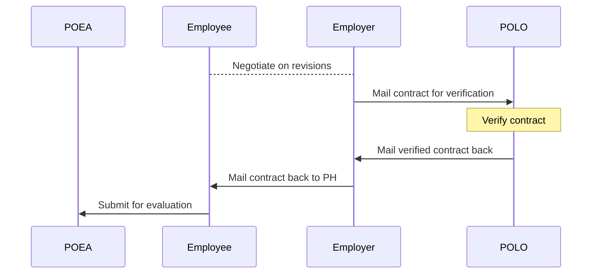

# Contract requirements

You need a verified contract from POLO.

## Process

> TODO: I'm still inquiring about this.

 

> Next: Negotiate on revisions by ensuring your work contract follows [POEA employment standards](employment_standards.md).
