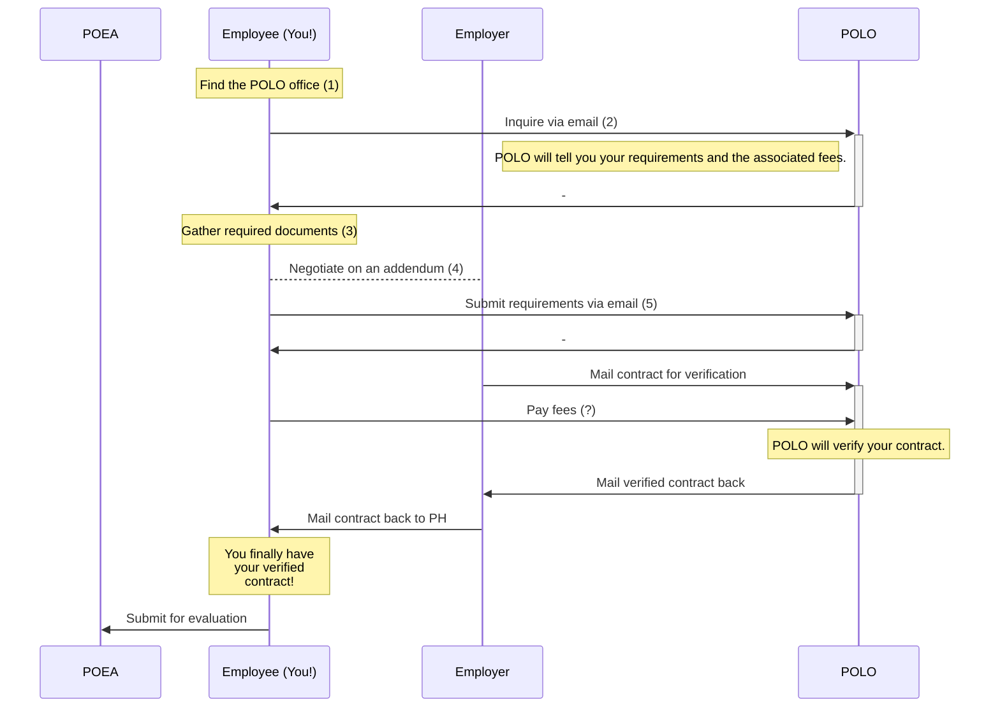

# _POLO_ Contract verification

You need a verified contract from the Philippine Overseas Labor Office (POLO) associated with your employer's country. This verified contract is part of POEA's requirements for direct hire evaluation.

## To do

1.  <input type='checkbox'> Find the [POLO office](./polo_locations.md) for your employer's country.

2.  <input type='checkbox'> Inquire to them through email.

3.  <input type='checkbox'> Gather all the documents they require. See the [required documents list](#requirements) below.

4.  <input type='checkbox'> Talk to your employer about getting a [contract addendum](./contract_addendum.md).

5.  <input type='checkbox'> Submit all of these to your POLO via email.

6.  ...TODO

## Process

## Requirements

These are the documents required by POLO for a contract verification. Be sure to inquire with POLO to get a list suited for you! In my experience, this list can differ, depending on the country and your circumstances.

|                         | Item                                                                                                    |
| ----------------------- | ------------------------------------------------------------------------------------------------------- |
| <input type='checkbox'> | **Employment contract**   Signed on all pages by the employer and the employee.                      |
| <input type='checkbox'> | **[Contract addendum]**   For extra provisions not covered by the employment contract (if necessary) |
| <input type='checkbox'> | **Your passport**                                                                                       |
| <input type='checkbox'> | **Your visa**                                                                                           |
| <input type='checkbox'> | **Business registration** of employer                                                                   |
| <input type='checkbox'> | **[Employer's ID]**   Passport or driver's license                                                        |
| <input type='checkbox'> | **[Company certification]**                                                                             |

 

> Next: Negotiate on revisions by ensuring your work contract follows [POEA employment standards](employment_standards.md).

[contract addendum]: ./contract_addendum.md
[company certification]: ./company_certification.md
[Employer's ID]: ./employer_id.md
