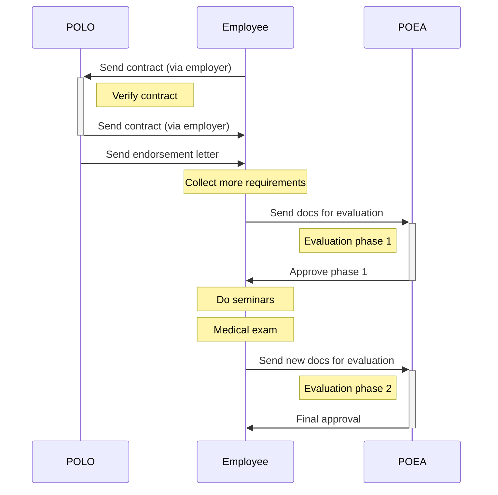

# Direct hires

POEA processes OEC's for **Agency Hires** and **Direct Hires.** If you didn't get your work visa through a recruitment agency, then you're a direct hire. Direct hires will need to coordinate with two government agencies:

* **Philippine Overseas Employment Administration** (POEA) in Manila, and
* **Philippine Overseas Labor Office** (POLO) abroad.

## The process

You need to acquire a verified contract from POLO, then go through 2 phases of evaluation in the POEA offices. There are many requirements along the way. See this diagram below for an overview:

> Next: Review the [Evaluation requirements](./direct_hire_evaluation.md) to understand what documents will be needed.
