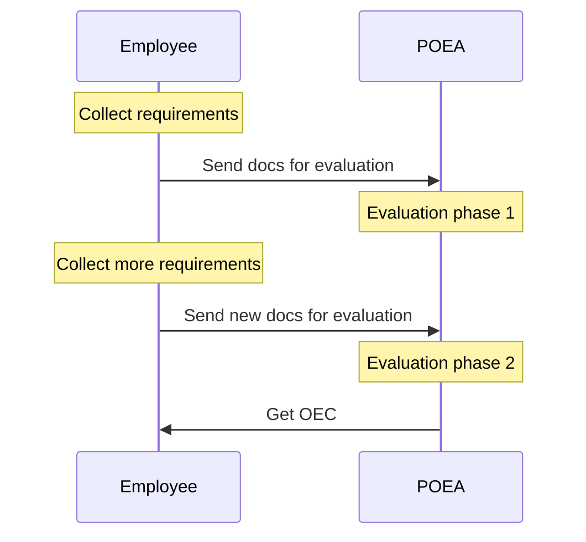

# Direct hires

```mermaid
sequenceDiagram
  participant Employee
  participant POEA

	Note over Employee: Collect requirements
  Employee->>POEA: Send docs for evaluation
	Note over POEA: Evaluation phase 1
	Note over Employee: Collect more requirements
  Employee->>POEA: Send new docs for evaluation
	Note over POEA: Evaluation phase 2
	POEA->>Employee: Get OEC
```

> Next: [Evaluation requirements](./direct_hire_evaluation.md)
