# Direct hire evaluation

**To acquire an OEC, you need to first be evaluated by the Direct Hire department of the POEA offices in EDSA.** To be evaluated, you'll need to submit all the documents in their checklist.

## Dependency graph

```mermaid
graph RL
OEC("<b>OEC</b><br>Overseas<br>Employment<br>Certificate")
EVAL1(<b>POEA<br>Evaluation<br>phase 1</b>)
EVAL2(<b>POEA<br>Evaluation<br>phase 2</b>)
PDOS[<b>PDOS</b><br>Pre-departure seminar]
PEOS[<b>PEOS</b><br>Pre-employment seminar]
CLEARANCE[<b>POEA clearance</b>]

PEME[<b>PEME</b><br>Medical exam]
click PEME "./medical_exam.html" "Medical exam"

CONTRACT(<b>POLO<br>Contract<br>verification</b>)
VERIFIED["<b>Verified contract</b><br>Verified by the<br>POLO (PH Overseas<br>Labor Office)"]
click VERIFIED "./polo_verification.html" "Verified contract"
REVISED["<b>Revised contract</b><br>With POEA-required<br>revisions"]
click REVISED "./employment_standards.html" "Revised contract"
CERTIFICATION["<b>Employer certification</b><br>Showing they hired 5<br>Filipinos max"]
COMPLIANCE["<b>POEA Compliance Sheet</b><br>To cover POEA requirements<br>missing in contract"]

ODOCS(" ")
PASSPORT["<b>Passport</b><br>Valid for 6+ months"]
VISA["<b>Work visa</b><br>or entry permit"]

ENDORSEMENT["<b>POLO endorsement</b><br>Endorsement letter"]
click ENDORSEMENT "./polo_endorsement.html" "POLO endorsement"
STATEMENT["<b>Notarized statement</b><br>Describe how you got the job"]
EMPLOYERID["<b>Employer's ID</b><br>Drivers license or passport"]

JOBDOCS(" ")
CV["<b>Resume / CV</b>"]
PRC["<b>PRC License</b><br>(PH Regulatory Commission)"]
DIPLOMA["<b>Diploma</b><br>and Transcript of Records"]
PROFILE["<b>Company profile</b><br>and business license of employer"]

OEC === EVAL2

EVAL2 --- PDOS
EVAL2 --- PEOS
EVAL2 --- CLEARANCE
EVAL2 --- PEME

EVAL1 === JOBDOCS
EVAL1 === ODOCS
VERIFIED === CONTRACT

subgraph For POEA evaluation
JOBDOCS --- STATEMENT
JOBDOCS --- CV
JOBDOCS --- PRC
JOBDOCS === VERIFIED
JOBDOCS --- DIPLOMA
JOBDOCS --- ENDORSEMENT
end

subgraph For POLO and POEA
ODOCS --- PASSPORT
ODOCS --- VISA
ODOCS --- PROFILE
end

subgraph For POLO verification
CONTRACT --- EMPLOYERID
CONTRACT --- REVISED
CONTRACT --- CERTIFICATION
CONTRACT --- COMPLIANCE
end

CONTRACT --- ODOCS
STATEMENT -.- |Needed for notarization| EMPLOYERID

PDOS --- EVAL1
PEOS --- EVAL1
CLEARANCE --- EVAL1
PEME --- EVAL1

style OEC fill:#fff,stroke:#333,stroke-width:9px
style EVAL1 fill:#fff,stroke:#3bd,stroke-width:9px
style EVAL2 fill:#fff,stroke:#3bd,stroke-width:9px
style CONTRACT fill:#fff,stroke:#d3b,stroke-width:9px

style ODOCS fill:#333,stroke-width:0
style JOBDOCS fill:#333,stroke-width:0
```

## May 2018 checklist

As of May 2018, this department issues a checklist of requirements. See: [Evaluation requirements](./evaluation_requirements.md). :warning: The list of requirements on the POEA website [is outdated](./skilled_worker_requirements_outdated.md).

 

> Next: Find out about the [direct hire ban](./direct_hire_exception.md), and how you can circumvent it.
