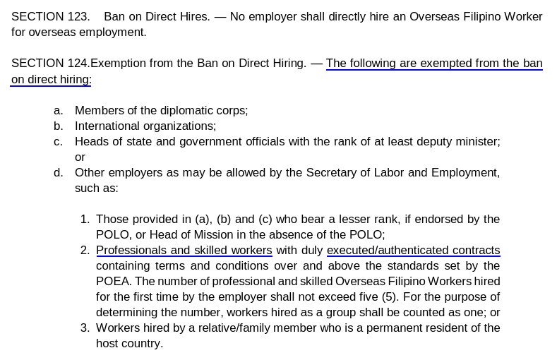

# _Introduction_ Direct hire ban history

**Government agencies may claim that there's a ban on direct hires. This is not true.** The POEA today has a ban on processing OEC requests from direct hires. However, skilled workers are exempted from this ban since 2016, and this was reinforced in 2018.

> 
>
> *&mdash; Taken from the [Revised POEA Rules and Regulations of 2016](./revised_poea_rules_of_2016.md), sections 123 to 124 (page 31). This exemption was also re-inforced in [Memorandum Circular No. 08 of 2018](./memorandum_circular_08.md), section I(d)(2).*

## You're (probably) not banned!

POEA has turned down many OEC applications saying that direct hires aren't being processed, or the direct hire exemptions may not include *professional & skilled workers*. As of May 2018, this is not true.

I looked into various government documents on the direct hire ban, and here's what I found.

## _2002_ Direct hiring was first banned

Direct hires were first banned in 2002. Foreign employers weren't allowed to hire
 Filipino workers, unless they were authorized by POEA. This was instituted in POEA's rules and regulations dating 2002:

> Section 8. Ban on Direct Hires. No foreign principal or employer may hire a Filipino worker for overseas employment except through the boards and entities authorized by the Secretary. Direct hiring by members of the diplomatic corps, international organizations and such other employers as may be allowed by the Secretary is exempt from this provision.
>
> *&mdash; [POEA Rules and Regulations Governing Recruitment and Employment of Land-based Overseas Workers (2002)](http://www.poea.gov.ph/laws&rules/files/2002%20POEA%20Rules%20on%20Overseas%20Employment%20of%20OFWs%20Full%20Text.pdf), rule III, section 8, page 18*

## _2016_ New skilled worker exemption

The rules and regulations first defined in 2002 were revised in 2016. Direct hires are still not allowed by the POEA. However, professionals and skilled workers are now exempted from the direct hire ban. See this excerpt from _§123_ and _§124(d)(2)_:

> SECTION 123. Ban on Direct Hires. — No employer shall directly hire an Overseas Filipino Worker for overseas employment.
>
> SECTION 124. Exemption from the Ban on Direct Hiring. — The following are exempted from the ban on direct hiring:
>
> ... d. Other employers as may be allowed by the Secretary of Labor and Employment, such as:
>
> ...... Professionals and skilled workers with duly executed/authenticated contracts containing terms and conditions over and above the standards set by the POEA. (...)
 >
> *&mdash; [Revised POEA Rules And Regulations Governing Recruitment and Employment of Land-based Overseas Workers (2016)](http://www.poea.gov.ph/laws&rules/files/Revised%20POEA%20Rules%20And%20Regulations.pdf), sections 123 to 124, page 31*

## _April 2017_ Direct hiring was suspended

On April 2017, POEA stopped processing OEC requests from direct hires. This was made official on the May 16th of 2017, when the Administrative Order (AO) was filed.

> "In the interest of justice, Administrative Order No. 155, series of 2017, suspending the processing and issuance of Overseas Employment Certificate (OEC) for all directly hired Overseas Filipino workers (OFW) is hereby RECALLED."
>
> *&mdash; [Public Advisory on DOLE Administrative Order 155-A](http://bangkokpe.dfa.gov.ph/advisories-and-announcements/720-public-advisory-on-dole-administrative-order-155-a-on-the-resumption-of-processing-and-issuance-of-the-overseas-employment-certificate-oec) (bangkokpe.dfa.gov.ph)*

More sources on this:

- [DOLE suspends exemptions to OFW direct hiring](http://news.abs-cbn.com/overseas/04/30/17/dole-suspends-exceptions-to-ofw-direct-hiring) _(news.abs-cbn.com)_
- [DOLE suspends exemptions of direct hire OFWs](https://www.dole.gov.ph/news/view/3633) _(dole.gov.ph)_

## _May 2017_ Direct hiring suspension recalled

This direct hire suspension was supposedly swiftly recalled. Here's an excerpt from a news article in May 17th, 2017:

> "I recalled the suspension of direct hiring of OFWs right after our investigation. Minabuti ko na imbestigahan na muna, at ngayong tapos na ang imbestigation, alam na namin kung sino ang mga involved, at nagkakaroon ng reorganization within the agency," Labor Secretary Silvestre Bello III said in the statement.
>
> *&mdash; [Direct hiring of OFWs allowed again as DOLE lifts suspension (2017)](http://news.abs-cbn.com/news/05/17/17/direct-hiring-of-ofws-allowed-again-as-dole-lifts-suspension)*

However, this is strange: DOLE AO-155 of 2017, the order of suspension, was filed on May 16th of 2017, which is 5 days after the article above.

When I also personally inquired in POEA's offices in Mandaluyong on May 16th of 2018, they claimed that professional and skilled workers aren't exempted from the direct hire ban.

## _May 2018_ Direct hire processing resumed

POEA issued a memorandum in May 2018 that reiterates the rules in 2016. This perhaps means that direct hires are being processed again by the POEA. I personally inquired in POEA's offices in Mandaluyong on May 26, and confirmed that their direct hire department is indeed honoring the memorandum and processing direct hires from skilled workers again.

> 
>
> *&mdash; [Memorandum Circular No. 08, Series of 2018, Implementing Guidelines on the Registration of Direct-Hire OFWs](http://www.poea.gov.ph/memorandumcirculars/2018/MC-08-2018.pdf), page 1*

## TL;DR

**Skilled workers are allowed to be directly hired without a recruitment agency,** contrary to what some government agencies may say.

 

> Next: You need to secure a [POLO endorsement](./polo_endorsement.md) to verify that you're exempted from the ban.
