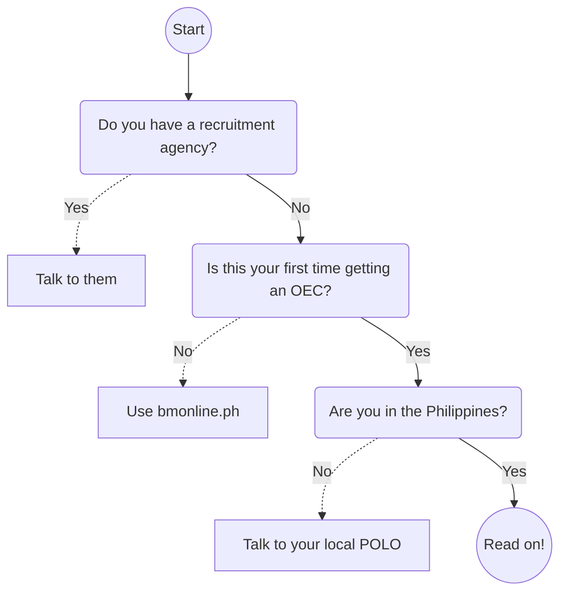

# _Introduction_ What's an OEC?

<figure class='right-figure' style='float: right; margin: 0 0 1em 1em;'> </figure>

**An OEC is your exit clearance out of the Philippines.** If you have a work visa abroad, the Bureau of Immigration in Philippine airports will not let you leave the Philippines without an OEC.

## What's it for?

Aside from being your exit clearance, the OEC ensures that you are a documented, tax-paying Overseas Filipino Worker (OFW). It also entitles you to protection from the Philippine Overseas Employment Administration (POEA) in the event of employer/employee disputes.

> The Overseas Employment Certificate (OEC) is a requirement under the rules and regulations of the Philippine Overseas Employment Administration (POEA) to help ensure that overseas Filipino workers (OFWs) are properly documented and protected.

## How do you get one?

* If you acquired your work through a recruitment agency, ask your recruitment agency. The process for agency hires is different from direct hires.

* If you had an OEC before, you can renew your expired OEC online using *Balik-Manggagawa Online* ([bmonline.ph]). An OEC has a maximum validity of 2 months (as of May 2018).

* If you're not in the Philippines, contact your nearest [Philippine Overseas Labor Office](./polo_verification.md) (POLO) for details.

* Otherwise, read on! You'll need to contact both POLO and POEA. This book is for you.

## Assumptions

This document outlines how you can get an OEC as a direct hire. This guide makes these assumptions about you:

* You have never acquired an OEC before.
* You don't have a recruitment agency.
* You are in the Philippines.
* You already have an employer abroad.
* You already have a working visa abroad.

 

> Next: [Process overview](./docs/process_overview.md)

[bmonline.ph]: http://www.bmonline.ph/
