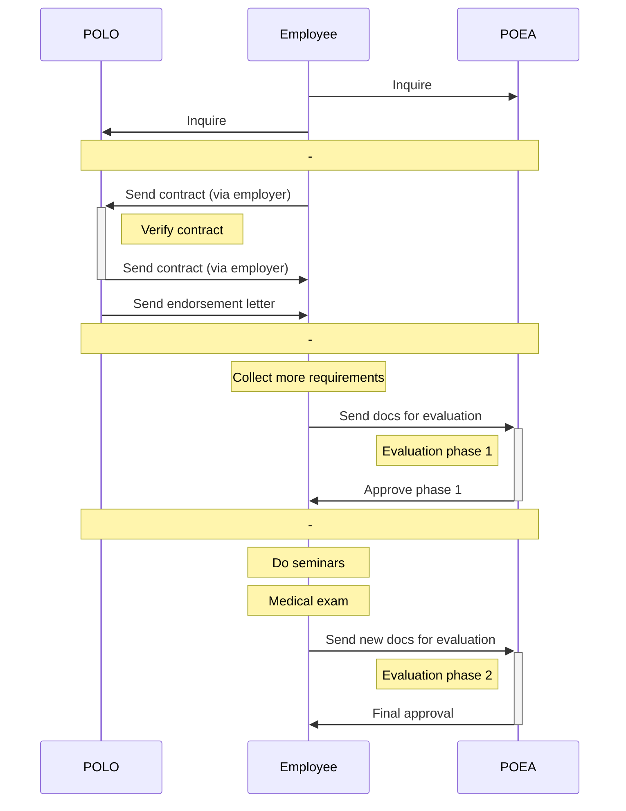

# _Introduction_ Process overview

Before you get started, first do some inquiries to Philippine Overseas Employment Agency (POEA) and Philippine Overseas Labor Office (POLO).

## Inquire first!

1. **Contact POEA and ask about how to get an OEC.**   It might be different from mine! Contact the [POEA direct hire department](./direct_hire_department.md) and ask about the requirements for an OEC.

2. **Find the POLO closest to your employer.**   The [Philippine Overseas Labor Office](polo_verification.md) will be verifying your employment contract. There are many POLO offices located overseas. Find out which POLO office is closest to your employer.

3. **Contact POLO and ask about how to get your employment contract verified.**   It also might be different from mine! Contact the POLO closest to your employer for more information.

All the notes in this book were gathered from POEA and POLO. Be sure to do your own inquiries and compare your requirements to what's listed here.

## Phases

There are 3 main phases involved in getting an Overseas Employment Certificate.

|     | Phase                                                                                                                                                  | Locations                                   |
| --- | ------------------------------------------------------------------------------------------------------------------------------------------------------ | ------------------------------------------- |
| 1.  | **[POLO contract verification]**   Your work contract needs to be verified by the Philippine Overseas Labor Office (POLO) closest to your employer. | [POLO offices], overseas (via mail)         |
| 2.  | **[POEA evaluation phase 1]**   Your documents will be evaluated by the POEA's direct hire department.                                              | [Direct Hire department] (POEA offices, EDSA) |
| 3.  | **[POEA evaluation phase 2]**   You will need to attend 2 seminars, and get a medical exam.                                                         | CFO; DOH-accredited health facilities       |

[polo contract verification]: ./contract.md
[polo offices]: ./polo_verification.md
[direct hire department]: ./direct_hire_department.md
[poea evaluation phase 1]: ./direct_hire_evaluation.md
[poea evaluation phase 2]: ./evaluation_phase_2.md

## Sequence

 

> Next: [What documents are required?](./requirements_overview.md)
