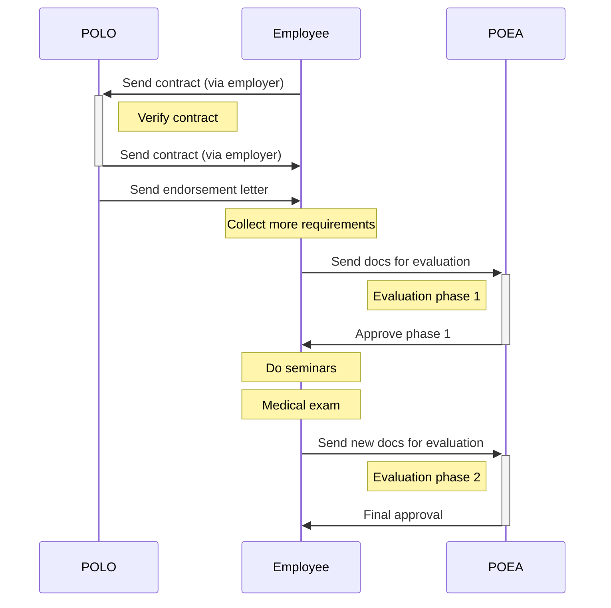

# _OEC guidebook_ Process overview

There are 3 main phases involved in getting an Overseas Employment Certificate.

|     | Phase                                                                                                                                                | Locations                                   |
| --- | ---------------------------------------------------------------------------------------------------------------------------------------------------- | ------------------------------------------- |
| 1.  | **[POLO contract verification]**   Your work contract needs to be verified by the Philippine Overseas Labor Office (POLO) closest to your employer. | POLO offices, overseas (via mail)           |
| 2.  | **[POEA evaluation phase 1]**   Your documents will be evaluated by the POEA's direct hire department.                                              | Direct Hire department (POEA offices, EDSA) |
| 3.  | **[POEA evaluation phase 2]**   You will need to attend 2 seminars, and get a medical exam.                                                         | CFO; DOH-accredited health facilities       |

[POLO contract verification]: ./contract.md
[POEA evaluation phase 1]: ./direct_hire_evaluation.md
[POEA evaluation phase 2]: ./evaluation_phase_2.md

## Sequence

 

> Next: [What documents are required?](./requirements_overview.md)
