# Requirements overview

```mermaid
graph RL
OEC("<b>OEC</b><br>Overseas<br>Employment<br>Certificate")
EVAL1(<b>POEA<br>Evaluation<br>phase 1</b>)
EVAL2(<b>POEA<br>Evaluation<br>phase 2</b>)

PDOS[<b>PDOS</b><br>Pre-departure seminar]
click PDOS "./pre_departure_orientation_seminar.html" "Pre-departure seminar"

PEOS[<b>PEOS</b><br>Pre-employment seminar]
click PEOS "./pre_employment_orientation_seminar.html" "Pre-employment seminar"

CLEARANCE[<b>POEA clearance</b>]

PEME[<b>PEME</b><br>Medical exam]
click PEME "./medical_exam.html" "Medical exam"

CONTRACT(<b>POLO<br>Contract<br>verification</b>)
click CONTRACT "./polo_verification.html" "Contract verification"

VERIFIED["<b>Verified contract</b><br>Verified by the<br>POLO (PH Overseas<br>Labor Office)"]
click VERIFIED "./polo_verification.html" "Verified contract"

REVISED["<b>Revised contract</b><br>With POEA-required<br>revisions"]
click REVISED "./employment_standards.html" "Revised contract"

CERTIFICATION["<b>Employer certification</b><br>Showing they hired 5<br>Filipinos max"]
COMPLIANCE["<b>POEA Compliance Sheet</b><br>To cover POEA requirements<br>missing in contract"]

ODOCS(" ")
PASSPORT["<b>Passport</b><br>Valid for 6+ months"]
VISA["<b>Work visa</b><br>or entry permit"]

ENDORSEMENT["<b>POLO endorsement</b><br>Endorsement letter"]
click ENDORSEMENT "./polo_endorsement.html" "POLO endorsement"

INSURANCE["<b>Proof of insurance</b><br>Endorsement letter"]
click INSURANCE "./proof_of_insurance.html" "Proof of insurance"

STATEMENT["<b>Notarized statement</b><br>Describe how you got the job"]
click STATEMENT "./notarized_statement.html" "Notarized statement"

EMPLOYERID["<b>Employer's ID</b><br>Drivers license or passport"]

JOBDOCS(" ")
CV["<b>Resume / CV</b>"]
PRC["<b>PRC License</b><br>(PH Regulatory Commission)"]
DIPLOMA["<b>Diploma</b><br>and Transcript of Records"]
PROFILE["<b>Company profile</b><br>and business license of employer"]

OEC === EVAL2

subgraph Phase 2
EVAL2 --- PDOS
EVAL2 --- PEOS
EVAL2 --- CLEARANCE
EVAL2 --- PEME
end

EVAL1 === JOBDOCS
EVAL1 === ODOCS
VERIFIED === CONTRACT

subgraph For POEA evaluation
JOBDOCS --- STATEMENT
JOBDOCS --- CV
JOBDOCS --- PRC
JOBDOCS === VERIFIED
JOBDOCS --- DIPLOMA
JOBDOCS --- ENDORSEMENT
JOBDOCS --- INSURANCE
end

subgraph For POLO and POEA
ODOCS --- PASSPORT
ODOCS --- VISA
ODOCS --- PROFILE
end

subgraph For POLO verification
CONTRACT --- EMPLOYERID
CONTRACT --- REVISED
CONTRACT --- CERTIFICATION
CONTRACT --- COMPLIANCE
end

CONTRACT --- ODOCS
STATEMENT -.- |Needed for notarization| EMPLOYERID

PDOS --- EVAL1
PEOS --- EVAL1
CLEARANCE --- EVAL1
PEME --- EVAL1

style OEC fill:#fff,stroke:#333,stroke-width:9px
style EVAL1 fill:#fff,stroke:#3bd,stroke-width:9px
style EVAL2 fill:#fff,stroke:#3bd,stroke-width:9px
style CONTRACT fill:#fff,stroke:#d3b,stroke-width:9px

style ODOCS fill:#333,stroke-width:0
style JOBDOCS fill:#333,stroke-width:0
```

## Direct hire

The process described here is for "direct hires"&mdash;that is, workers who acquired work without the intercession of a recruitment agency. As of May 2018, POEA has a ban on processing direct hire applications, and you need to prove that you're exempted as a skilled worker.

See [Direct hire](./direct_hire.md) to understand what a "Direct Hire" is, and how to acquire an endorsement letter to prove your exemption as a skilled worker.

## Common documents

These documents are required by both POLO (for contract verification) and POEA (for phase 1 evaluation).

> * <input type='checkbox'> **Passport**
> * <input type='checkbox'> **Visa**
> * <input type='checkbox'> **Business registration** of the employer

## POLO verification

Everything in [common documents](#common-documents) above, and the following:

> * <input type='checkbox'> **Employment contract**, signed on all pages by the employer and the worker
> * <input type='checkbox'> **Employers passport** or drivers license
> * <input type='checkbox'> **Company certification** that they have not hired more than 5 Filipino workers processed by POEA and POLO and that the company has not partnered with Philippine Recruitment agency to process the deployment of their workers.
> * <input type='checkbox'> **POEA Compliance Sheet,** which should be signed by the employer in order to cover the Philippine requirements that are not covered by the employment contract

## POEA phase 1

Everything in [common documents](#common-documents) above, and the following:

> * <input type='checkbox'> **Notarized statement**
> * <input type='checkbox'> **Resume/CV**
> * <input type='checkbox'> **PRC License**
> * <input type='checkbox'> **Verified contract** from POLO
> * <input type='checkbox'> **Diploma**
> * <input type='checkbox'> **POLO endorsement**
> * <input type='checkbox'> **Proof of insurance**

## POEA phase 2

> * <input type='checkbox'> Pre-Departure Orientation Seminar (PDOS)
> * <input type='checkbox'> Pre-Employment Orientation Seminar (PEOS)
> * <input type='checkbox'> Pre-Employment Medical Exam (PEME)
> * <input type='checkbox'> POEA clearance

 

> Next: [What is a direct hire](./docs/direct_hire.md), and how do I get an OEC as a direct hire?
