# _Introduction_ Requirements overview

Here's a list of items required by both POLO (`A`) and POEA (`B` and `C`).

|                         | Item                                                                                                                                        | A   | B   | C   |
| ---                     | ---                                                                                                                                         | --- | --- | --- |
| <input type='checkbox'> | **Your passport**   Must be valid for at least 6 months                                                                                  | x   | x   |     |
| <input type='checkbox'> | **Your visa**   Visa or entry permit                                                                                                     | x   | x   |     |
| <input type='checkbox'> | **Business registration**   of the employer                                                                                              | x   | x   |     |
| <input type='checkbox'> | **Employment contract**   Signed on all pages by the employer and employee                                                               | x   |     |     |
| <input type='checkbox'> | **[Contract addendum]**   (If needed) additions to the work contract to conform to POEA standards                                        | x   |     |     |
| <input type='checkbox'> | **[Employer's ID]**   Passport or driver's license                                                                                       | x   |     |     |
| <input type='checkbox'> | **[Business registration]**   Showing that they hired 5 Filipinos max, and that they haven't dealt with a Philippine recruitement agency | x   |     |     |
| <input type='checkbox'> | **[Notarized statement]**   Describing how you found your work abroad                                                                    |     | x   |     |
| <input type='checkbox'> | **Resume/CV**                                                                                                                               |     | x   |     |
| <input type='checkbox'> | **[NC II/PRC license]()**   If applicable                                                                                                |     | x   |     |
| <input type='checkbox'> | **[Verified contract]**   Employment contract verified by POLO                                                                           |     | x   |     |
| <input type='checkbox'> | **Diploma**                                                                                                                                 |     | x   |     |
| <input type='checkbox'> | **Transcript of records**                                                                                                                   |     | x   |     |
| <input type='checkbox'> | **[POLO endorsement]**   To verify that you're exempted from the direct hire ban                                                         |     | x   |     |
| <input type='checkbox'> | **[Proof of insurance]**                                                                                                                    |     | x   |     |
| <input type='checkbox'> | **Country-specific requirements**   for USA, Canada, Middle East, and African countries                                                  |     | x   |     |
| <input type='checkbox'> | **[PDOS]**   Pre-Departure Orientation Seminar                                                                                           |     |     | x   |
| <input type='checkbox'> | **[PEOS]**   Pre-Employment Orientation Seminar                                                                                          |     |     | x   |
| <input type='checkbox'> | **[PEME]**   Pre-Employment Medical Exam                                                                                                 |     |     | x   |
| <input type='checkbox'> | **POEA clearance**                                                                                                                          |     |     | x   |

`A` - [POLO contract verification](./contract.md), `B` - [POEA evaluation phase 1](./direct_hire_evaluation.md), `C` - [POEA evaluation phase 2](./evaluation_phase_2.md)

[business registration]: ./company_certification.md
[contract addendum]: ./contract_addendum.md
[employer's id]: ./employer_id.md
[nc ii/prc license]: ./prc_license.md
[notarized statement]: ./notarized_statement.md
[pdos]: ./pre_departure_orientation_seminar.md
[peme]: ./medical_exam.md
[peos]: ./pre_employment_orientation_seminar.md
[polo endorsement]: ./polo_endorsement.md
[proof of insurance]: ./proof_of_insurance.md
[verified contract]: ./contract.md

## Dependency graph

Items on the *right* require the items linked to its *left.* For example, an *OEC* requires *POEA evaluation phase 2*, which requires *PDOS seminar*, and so on.

```mermaid
graph RL
OEC("<b>OEC</b><br>Overseas<br>Employment<br>Certificate")
EVAL1(<b>POEA<br>Evaluation<br>phase 1</b>)
click EVAL1 "./direct_hire_evaluation.html" "POEA evaluation phase 1"

EVAL2(<b>POEA<br>Evaluation<br>phase 2</b>)

PDOS[<b>PDOS</b><br>Pre-departure seminar]
click PDOS "./pre_departure_orientation_seminar.html" "Pre-departure seminar"

PEOS[<b>PEOS</b><br>Pre-employment seminar]
click PEOS "./pre_employment_orientation_seminar.html" "Pre-employment seminar"

CLEARANCE[<b>POEA clearance</b>]

PEME[<b>PEME</b><br>Medical exam]
click PEME "./medical_exam.html" "Medical exam"

CONTRACT(<b>POLO<br>Contract<br>verification</b>)
click CONTRACT "./contract.html" "Contract verification"

VERIFIED["<b>Verified contract</b><br>Verified by the<br>POLO (PH Overseas<br>Labor Office)"]
click VERIFIED "./contract.html" "Verified contract"

EMPLOYMENTCONTRACT["<b>Employment contract</b><br>With POEA-required<br>revisions"]
ADDENDUM["<b>Contract addendum</b><br>if needed"]
click ADDENDUM "./contract_addendum.html" "Contract addendum"

CERTIFICATION["<b>Company certification</b><br>Showing they hired 5<br>Filipinos max"]

ODOCS(" ")
PASSPORT["<b>Passport</b><br>Valid for 6+ months"]
VISA["<b>Work visa</b><br>or entry permit"]

ENDORSEMENT["<b>POLO endorsement</b><br>Endorsement letter"]
click ENDORSEMENT "./polo_endorsement.html" "POLO endorsement"

INSURANCE["<b>Proof of insurance</b><br>Endorsement letter"]
click INSURANCE "./proof_of_insurance.html" "Proof of insurance"

STATEMENT["<b>Notarized statement</b><br>Describe how you got the job"]
click STATEMENT "./notarized_statement.html" "Notarized statement"

EMPLOYERID["<b>Employer's ID</b><br>Drivers license or passport"]

JOBDOCS(" ")
CV["<b>Resume / CV</b>"]
PRC["<b>PRC License</b><br>(Professional Regulatory Commission)"]
click PRC "./prc_license.html" "PRC license"

DIPLOMA["<b>Diploma</b>"]
TRANSCRIPT["<b>Transcript of Records</b>"]
PROFILE["<b>Business registration</b><br>and business license of employer"]

OEC === EVAL2

subgraph Phase 2
EVAL2 --- PDOS
EVAL2 --- PEOS
EVAL2 --- CLEARANCE
EVAL2 --- PEME
end

EVAL1 === JOBDOCS
EVAL1 === ODOCS
VERIFIED === CONTRACT

subgraph For POEA evaluation
JOBDOCS --- STATEMENT
JOBDOCS --- CV
JOBDOCS --- PRC
JOBDOCS === VERIFIED
JOBDOCS --- DIPLOMA
JOBDOCS --- TRANSCRIPT
JOBDOCS --- ENDORSEMENT
JOBDOCS --- INSURANCE
end

subgraph For POLO and POEA
ODOCS --- PASSPORT
ODOCS --- VISA
ODOCS --- PROFILE
end

subgraph For POLO verification
CONTRACT --- EMPLOYERID
CONTRACT --- EMPLOYMENTCONTRACT
CONTRACT --- ADDENDUM
CONTRACT --- CERTIFICATION
end

CONTRACT --- ODOCS
STATEMENT -.- |Needed for notarization| EMPLOYERID

PDOS --- EVAL1
PEOS --- EVAL1
CLEARANCE --- EVAL1
PEME --- EVAL1

style OEC fill:#fff,stroke:#333,stroke-width:9px
style EVAL1 fill:#fff,stroke:#3bd,stroke-width:9px
style EVAL2 fill:#fff,stroke:#3bd,stroke-width:9px
style CONTRACT fill:#fff,stroke:#d3b,stroke-width:9px

style ODOCS fill:#333,stroke-width:0
style JOBDOCS fill:#333,stroke-width:0

```

## Direct hire

The process and requirements described here are for "direct hires"&mdash;that is, workers who acquired work without the intercession of a recruitment agency. See [direct hire](./direct_hire.md) to understand what a "Direct Hire" is, and how to apply for an OEC as a direct hire.

 

> Next: [What is a direct hire](./direct_hire.md), and how do I get an OEC as a direct hire?
