# _OEC guidebook_ Requirements overview

```mermaid
graph RL
OEC("<b>OEC</b><br>Overseas<br>Employment<br>Certificate")
EVAL1(<b>POEA<br>Evaluation<br>phase 1</b>)
click EVAL1 "./direct_hire_evaluation.html" "POEA evaluation phase 1"

EVAL2(<b>POEA<br>Evaluation<br>phase 2</b>)

PDOS[<b>PDOS</b><br>Pre-departure seminar]
click PDOS "./pre_departure_orientation_seminar.html" "Pre-departure seminar"

PEOS[<b>PEOS</b><br>Pre-employment seminar]
click PEOS "./pre_employment_orientation_seminar.html" "Pre-employment seminar"

CLEARANCE[<b>POEA clearance</b>]

PEME[<b>PEME</b><br>Medical exam]
click PEME "./medical_exam.html" "Medical exam"

CONTRACT(<b>POLO<br>Contract<br>verification</b>)
click CONTRACT "./contract.html" "Contract verification"

VERIFIED["<b>Verified contract</b><br>Verified by the<br>POLO (PH Overseas<br>Labor Office)"]
click VERIFIED "./contract.html" "Verified contract"

EMPLOYMENTCONTRACT["<b>Employment contract</b><br>With POEA-required<br>revisions"]
ADDENDUM["<b>Contract addendum</b><br>if needed"]
click ADDENDUM "./cnotract_addendum.html" "Contract addendum"

CERTIFICATION["<b>Company certification</b><br>Showing they hired 5<br>Filipinos max"]

ODOCS(" ")
PASSPORT["<b>Passport</b><br>Valid for 6+ months"]
VISA["<b>Work visa</b><br>or entry permit"]

ENDORSEMENT["<b>POLO endorsement</b><br>Endorsement letter"]
click ENDORSEMENT "./polo_endorsement.html" "POLO endorsement"

INSURANCE["<b>Proof of insurance</b><br>Endorsement letter"]
click INSURANCE "./proof_of_insurance.html" "Proof of insurance"

STATEMENT["<b>Notarized statement</b><br>Describe how you got the job"]
click STATEMENT "./notarized_statement.html" "Notarized statement"

EMPLOYERID["<b>Employer's ID</b><br>Drivers license or passport"]

JOBDOCS(" ")
CV["<b>Resume / CV</b>"]
PRC["<b>PRC License</b><br>(PH Regulatory Commission)"]
DIPLOMA["<b>Diploma</b><br>and Transcript of Records"]
PROFILE["<b>Company profile</b><br>and business license of employer"]

OEC === EVAL2

subgraph Phase 2
EVAL2 --- PDOS
EVAL2 --- PEOS
EVAL2 --- CLEARANCE
EVAL2 --- PEME
end

EVAL1 === JOBDOCS
EVAL1 === ODOCS
VERIFIED === CONTRACT

subgraph For POEA evaluation
JOBDOCS --- STATEMENT
JOBDOCS --- CV
JOBDOCS --- PRC
JOBDOCS === VERIFIED
JOBDOCS --- DIPLOMA
JOBDOCS --- ENDORSEMENT
JOBDOCS --- INSURANCE
end

subgraph For POLO and POEA
ODOCS --- PASSPORT
ODOCS --- VISA
ODOCS --- PROFILE
end

subgraph For POLO verification
CONTRACT --- EMPLOYERID
CONTRACT --- EMPLOYMENTCONTRACT
CONTRACT --- ADDENDUM
CONTRACT --- CERTIFICATION
end

CONTRACT --- ODOCS
STATEMENT -.- |Needed for notarization| EMPLOYERID

PDOS --- EVAL1
PEOS --- EVAL1
CLEARANCE --- EVAL1
PEME --- EVAL1

style OEC fill:#fff,stroke:#333,stroke-width:9px
style EVAL1 fill:#fff,stroke:#3bd,stroke-width:9px
style EVAL2 fill:#fff,stroke:#3bd,stroke-width:9px
style CONTRACT fill:#fff,stroke:#d3b,stroke-width:9px

style ODOCS fill:#333,stroke-width:0
style JOBDOCS fill:#333,stroke-width:0

```

## Items

|                         | Item                                                                                                                                      | POLO Verification | Eval Phase 1 | Eval Phase 2 |
| ---                     | ---                                                                                                                                       | ---                  | ---             | ---             |
| <input type='checkbox'> | **Your passport**   Must be valid for at least 6 months                                                                                | x                    | x               |                 |
| <input type='checkbox'> | **Your visa**   Visa or entry permit                                                                                                   | x                    | x               |                 |
| <input type='checkbox'> | **Business registration**   of the employer                                                                                            | x                    | x               |                 |
| <input type='checkbox'> | **Employment contract**   Signed on all pages by the employer and employee                                                             | x                    |                 |                 |
| <input type='checkbox'> | **[Contract addendum](./contract_addendum.md)**   (If needed) additions to the work contract to conform to POEA standards              | x                    |                 |                 |
| <input type='checkbox'> | **Employer's ID**   Passport or driver's license                                                                                       | x                    |                 |                 |
| <input type='checkbox'> | **Company certification**   Showing that they hired 5 Filipinos max, and that they haven't dealt with a Philippine recruitement agency | x                    |                 |                 |
| <input type='checkbox'> | **[Notarized statement](./notarized_statement.md)**   Describing how you found your work abroad                                        |                      | x               |                 |
| <input type='checkbox'> | **Resume/CV**                                                                                                                             |                      | x               |                 |
| <input type='checkbox'> | **PRC license**, if applicable                                                                                                            |                      | x               |                 |
| <input type='checkbox'> | **Verified contract** from POLO                                                                                                           |                      | x               |                 |
| <input type='checkbox'> | **Diploma**                                                                                                                               |                      | x               |                 |
| <input type='checkbox'> | **Transcript of records**                                                                                                                 |                      | x               |                 |
| <input type='checkbox'> | **[POLO endorsement](./polo_endorsement.md)**                                                                                             |                      | x               |                 |
| <input type='checkbox'> | **[Proof of insurance](./proof_of_insurance.md)**                                                                                         |                      | x               |                 |
| <input type='checkbox'> | Country-specific requirements   for USA, Canada, Middle East, and African countries                                                    |                      | x               |                 |
| <input type='checkbox'> | **[PDOS](./pre_departure_orientation_seminar.md)**, Pre-Departure Orientation Seminar                                                     |                      |                 | x               |
| <input type='checkbox'> | **[PEOS](./pre_employment_orientation_seminar.md)**, Pre-Employment Orientation Seminar                                                   |                      |                 | x               |
| <input type='checkbox'> | **[PEME](./medical_exam.md)**, Pre-Employment Medical Exam                                                                                |                      |                 | x               |
| <input type='checkbox'> | **POEA clearance**                                                                                                                        |                      |                 | x               |

## Direct hire

The process and requirements described here are for "direct hires"&mdash;that is, workers who acquired work without the intercession of a recruitment agency. As of May 2018, POEA has a ban on processing direct hire applications, and you need to prove that you're exempted as a skilled worker.

See [Direct hire](./direct_hire.md) to understand what a "Direct Hire" is, and how to acquire an endorsement letter to prove your exemption as a skilled worker.

 

> Next: [What is a direct hire](./direct_hire.md), and how do I get an OEC as a direct hire?
