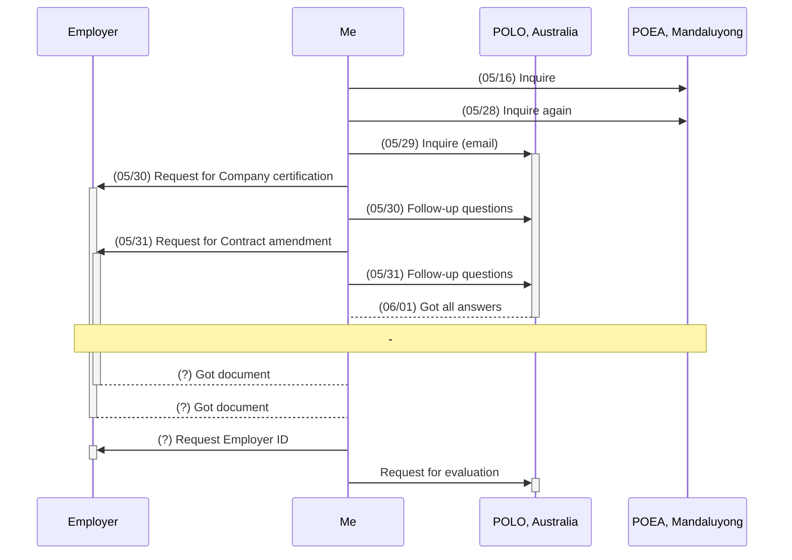

# Rico's timeline

| When   | What                                               | Phase |
| ----   | ----                                               | ----  |
| May 9  | Got my Australian visa approved                    | -     |
| May 16 | Inquire at POEA Mandaluyong                        | -     |
| May 28 | Inquire at POEA Mandaluyong, again                 | -     |
| May 29 | Inquire at POLO Canberra                           | -     |
| May 30 | Request **Company certification** from my employer | A     |
| May 31 | Request **Contract amendment** from my employer    | A     |

## Diagram

